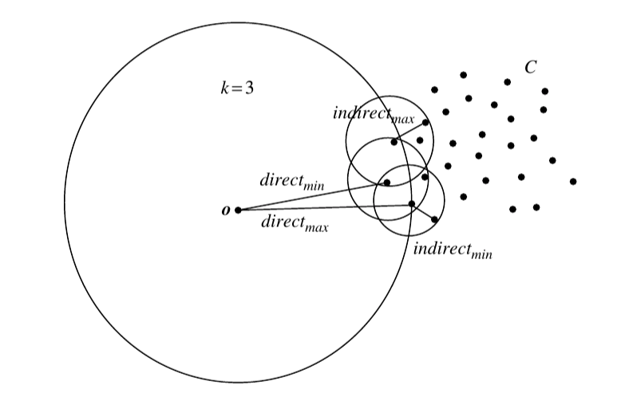

# SOD

**Note**: The `master` branch may be in an *unstable or even broken state* during development. Please use [releases][github-release] instead of the `master` branch in order to get stable binaries.

**Note**: The current version is not intended for use in production

## 

SOD  - simple outlier detection. A simple solution for detecting anomalies in a vector data stream with a focus on being:

* *Simple*: well-defined, user-facing HTTP API
* *Fast*: benchmarked 1,000 prediction/sec on core, million samples
* *Storage*: automatically maintains the actual required range of the sample data
* *Without training*: Uses the k nearest neighbor algorithm to detect anomalies without training data

## Description

SOD is written in Go and consists of several components: a database, an algorithm for detecting anomalies, notifications, and an HTTP interface for access.
The data storage system uses etcd/bbolt - a key/value embedded database that saves a set of data to disk.
Anomaly recognition is based on the LOF - local outlier factor method.
This method uses the k nearest neighbor method to detect anomalies.
To notify about an anomaly found, SOD sends a POST request with data.

## LOF white paper



[LOF agorithm white paper](https://www.dbs.ifi.lmu.de/Publikationen/Papers/LOF.pdf)

## Getting started

### Getting SOD

The simplest method to run is to run the docker image and throw the necessary environment variables.

### Running SOD

SOD uses the configuration method via environment variables. 
Running SOD from the repository

```
 $ git clone https://github.com/robotomize/sod.git
 $ cd sod
 $ go build cmd/sod
```

or build docker image

```bash
 $ docker build .
```

By default, the application runs on **:8787**. SOD operates in two modes:

### Predict handle

Predict(read only) is getting the value outlier or not outlier without saving the state.

Your request will be mapped to the following structure

POST request to /predict
```json
{
  "entity": "user-lives",
  "data": [
    {"vector": [10], "extra": "robotomize", "createdAt": "timestamp"},
    {"vector": [10], "extra": "robotomize", "createdAt": "timestamp"},
    {"vector": [10], "extra": "robotomize", "createdAt": "timestamp"},
    {"vector": [100], "extra": "robotomize", "createdAt": "timestamp"}
  ] 
}
```

```bash
curl -X POST -d '{entityId: "user-lives", "data": [ {"vector": [10], "extra": "robotomize", "createdAt": "timestamp"}, {"vector": [10], "extra": "robotomize", "createdAt": "timestamp"}, {"vector": [10], "extra": "robotomize", "createdAt": "timestamp"}, {"vector": [100], "extra": "robotomize", "createdAt": "timestamp"}]}' http://localhost:8787/predict
```

response
```json
{
  "entity": "user-lives",
  "data": [
    {"vector": [100], "outlier": true, "extra": "robotomize", "createdAt": "timestamp"}
  ] 
}
```

### Collect handle

Collect(read write) - To save the value in SOD, recognize it, and inform your applications about the outlier, send a POST request to the /collect address

let's say we collect weather data

POST request to /collect
```json
{
  "entity": "weather",
  "data": [
    {"vector": [20, 365, 7], "extra": "20-10-2020", "createdAt": "timestamp"},
    {"vector": [21, 364, 2], "extra": "21-10-2020", "createdAt": "timestamp"},
    {"vector": [20, 365, 5], "extra": "22-10-2020", "createdAt": "timestamp"},
    {"vector": [25, 370, 0], "extra": "22-10-2020", "createdAt": "timestamp"}
  ] 
}
```

response
```json
{"status":  "ok"}
```

### Health check

```bash
curl -X GET http://localhost:8787/health
```

response
```json
{"status":  "ok"}  
```

### Documentation
* [Installation](docs/installation.md)

### License

SOD is under the Apache 2.0 license. See the [LICENSE](LICENSE) file for details.
